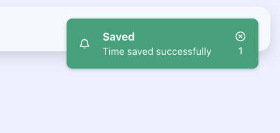
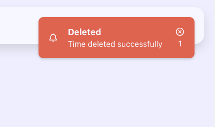
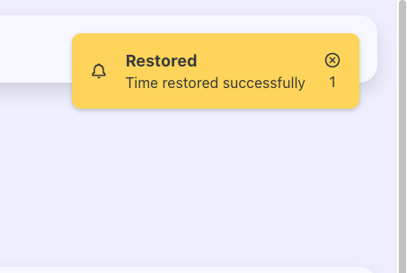
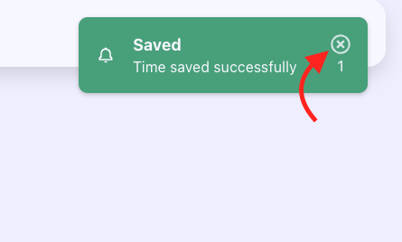

# ⚛️ Atomic React - React Components Exercise "Toasts"

## ⬇️ Install and run the project

To start the exercise, clone the repository:

```bash
git clone git@github.com:Atomic-React/react-components-ex-toasts.git
```

Go to the project folder

```bash
cd react-components-ex-toasts
```

Install dependencies:

```bash
npm install
```

Run the project:

```bash
npm run dev
```

## 📝 The exercise

The aim of this exercise is to practice the following concepts:

* State
* State updates
* Props
* Events
* Components life cycle
* Portals
* Props validation

After cloning the repository, installing dependencies and running the project, go to `http://localhost:5173` in your browser.

> ℹ️ In the code, you can find a `Toast/` component folder in the `components/` folder.

### Master the toasts 🍞

The expected behavior is that when start and then stop a timer, a toast notification should appear in the right corner of the screen:



We should have 3 kinds of toast notification:

* A success toast notification with a green background that appears when a time is saved.
* A danger toast notification with a red background that appears when a time is deleted.
* A warning toast notification with a yellow background that appears when a time is restored from the bin.

#### Examples




Each toast notification should auto-dismiss after a delay and should take personnalized title and message.

As a developer using implementing a toast notification, I should be able to set a personnalized delay for the auto-dismiss behavior.

Each toast notification should be dismissable before the auto-dismiss delay expire by the user clicking on the "X" button placed in the top right corner of the toast:



> ℹ️ The CSS of the toast variants are already there in the `Toast.css`

### End then ?

You are done ! 🎉

Find the full correction of the exercise here: <https://github.com/Atomic-React/react-components-ex-toasts/tree/correction>
